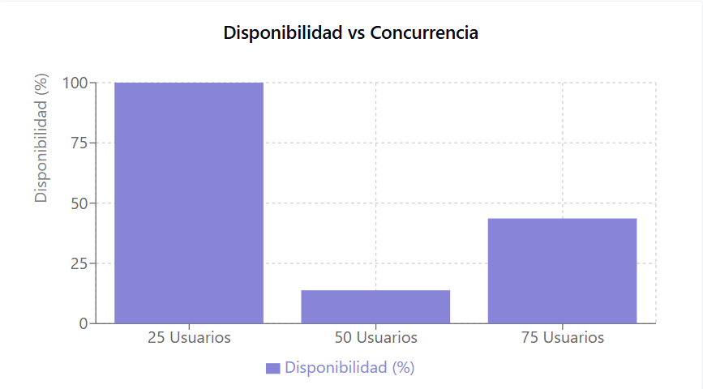

# Informe de Pruebas de Balanceo de Carga

## Resumen Ejecutivo

Este informe presenta los resultados de las pruebas de balanceo de carga realizadas en un servidor web Apache usando las herramientas ApacheBench y Siege. Las pruebas fueron diseñadas para evaluar el rendimiento del servidor bajo diferentes niveles de concurrencia y carga, con el objetivo de determinar su capacidad de respuesta, estabilidad y límites operativos.

## Herramientas Utilizadas

1. **ApacheBench (ab)**: Herramienta de benchmarking para servidores HTTP de Apache, utilizada para las pruebas iniciales con concurrencia controlada.
2. **Siege**: Herramienta de prueba de carga y estrés HTTP, utilizada para simular múltiples usuarios concurrentes durante períodos específicos.

## Configuración del Entorno

- **Servidor Web**: Apache/2.4.62
- **Host**: localhost
- **Puerto**: 80
- **Sistema Operativo**: Linux (Parrot OS)

## Análisis de Resultados

### Prueba 1: ApacheBench - Concurrencia 30

| Métrica | Valor |
|---------|-------|
| Concurrencia | 30 |
| Solicitudes Totales | 300 |
| Tiempo Total | 6.515 segundos |
| Solicitudes por Segundo | 46.05 |
| Tiempo por Solicitud (media) | 651.452 ms |
| Tiempo por Solicitud (concurrente) | 21.715 ms |
| Tasa de Transferencia | 487.63 KB/s |
| Tamaño del Documento | 10534 bytes |
| Solicitudes Fallidas | 0 |

### Prueba 2: ApacheBench - Concurrencia 40

| Métrica | Valor |
|---------|-------|
| Concurrencia | 40 |
| Solicitudes Totales | 1331 |
| Tiempo Total | 30.005 segundos |
| Solicitudes por Segundo | 44.36 |
| Tiempo por Solicitud (media) | 901.738 ms |
| Tiempo por Solicitud (concurrente) | 22.543 ms |
| Tasa de Transferencia | 2182.24 KB/s |
| Tamaño del Documento | 50138 bytes |
| Solicitudes Fallidas | 0 |

### Prueba 3-5: Siege - Diferentes Niveles de Usuarios Concurrentes

| Métrica | 25 Usuarios | 50 Usuarios | 75 Usuarios |
|---------|------------|------------|------------|
| Transacciones | 1954 | 172 | 850 |
| Disponibilidad | 100.00% | 13.82% | 43.63% |
| Tiempo Transcurrido | 19.72s | 15.76s | 16.44s |
| Datos Transferidos | 6.96 MB | 1.00 MB | 3.57 MB |
| Tiempo de Respuesta | 0.23s | 4.48s | 1.42s |
| Tasa de Transacciones | 99.09 | 10.91 | 51.70 |
| Rendimiento | 0.35 MB/s | 0.06 MB/s | 0.22 MB/s |
| Concurrencia | 22.94 | 48.90 | 73.33 |
| Transacciones Exitosas | 1954 | 172 | 850 |
| Transacciones Fallidas | 0 | 1073 | 1098 |
| Transacción más Larga | 3.96s | 10.53s | 9.14s |

## Análisis Gráfico

### Disponibilidad vs. Concurrencia
![Gráfico de Disponibilidad vs. Concurrencia]

Con 25 usuarios concurrentes, la disponibilidad es del 100%, pero cae drásticamente al 13.82% con 50 usuarios y se recupera parcialmente al 43.63% con 75 usuarios. Esto sugiere un punto crítico entre 25 y 50 usuarios concurrentes donde el sistema comienza a fallar significativamente.

### Transacciones Exitosas vs. Fallidas
![Gráfico de Transacciones Exitosas vs. Fallidas]

A medida que aumenta la concurrencia, la proporción de transacciones fallidas aumenta significativamente. Con 25 usuarios, todas las transacciones son exitosas, pero con 50 y 75 usuarios, la mayoría de las transacciones fallan.

### Tiempo de Respuesta vs. Concurrencia
![Gráfico de Tiempo de Respuesta vs. Concurrencia]

El tiempo de respuesta aumenta de 0.23s con 25 usuarios a 4.48s con 50 usuarios, y luego mejora a 1.42s con 75 usuarios. Esto indica un comportamiento no lineal en el sistema bajo carga.

## Conclusiones

1. **Límite de Concurrencia**: El servidor muestra un rendimiento óptimo con hasta aproximadamente 25 usuarios concurrentes, donde mantiene una disponibilidad del 100% y tiempos de respuesta rápidos (0.23s). Este debería considerarse el límite operativo seguro para garantizar un servicio confiable.

2. **Punto de Ruptura**: Entre 25 y 50 usuarios concurrentes, el sistema alcanza un punto de ruptura crítico donde la disponibilidad cae drásticamente (13.82%) y los tiempos de respuesta aumentan significativamente (4.48s).

3. **Comportamiento No Lineal**: Curiosamente, algunas métricas mejoran cuando se pasa de 50 a 75 usuarios concurrentes, lo que sugiere un comportamiento no lineal en el sistema. Esto podría indicar que el servidor implementa algún mecanismo de defensa o estrategia de gestión de recursos que se activa bajo carga extrema.

4. **Fiabilidad**: ApacheBench muestra que, con una concurrencia controlada, el servidor es capaz de manejar todas las solicitudes sin fallos (0 solicitudes fallidas). Sin embargo, Siege muestra que bajo condiciones de estrés sostenido, el servidor comienza a rechazar conexiones.

5. **Escalabilidad**: Los resultados indican una necesidad de escalabilidad horizontal (más servidores) si se espera soportar más de 25 usuarios concurrentes de manera consistente.

## Recomendaciones

1. **Implementar Balanceo de Carga**: Distribuir el tráfico entre múltiples servidores para manejar más de 25 usuarios concurrentes de manera efectiva.

2. **Optimizar la Configuración de Apache**: Revisar y ajustar parámetros como `MaxClients`, `MaxRequestWorkers`, `KeepAliveTimeout` y otros relacionados con la gestión de conexiones.

3. **Monitoreo Continuo**: Implementar un sistema de monitoreo para detectar cuándo el servidor se acerca a su límite de capacidad.

4. **Pruebas Adicionales**: Realizar pruebas adicionales con incrementos más graduales de concurrencia para identificar con mayor precisión el punto exacto donde el rendimiento comienza a degradarse.

5. **Análisis de Recursos**: Complementar estas pruebas con monitoreo de recursos del sistema (CPU, memoria, I/O) durante las pruebas para identificar cuellos de botella específicos.

6. **Considerar Caché**: Implementar soluciones de caché para reducir la carga en el servidor para contenido estático o frecuentemente solicitado.

